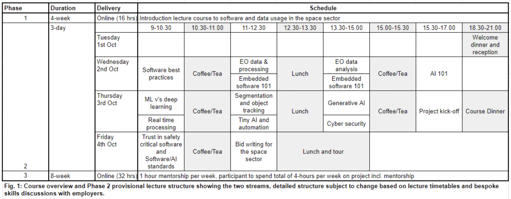
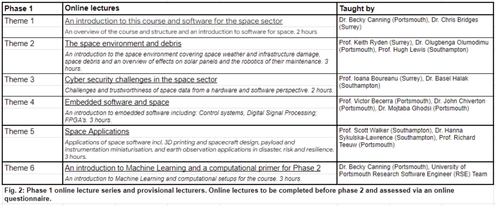

Introduction
============

We are delighted to welcome you, our first cohort, to the Securing the future of space: Space Software and Data/AI CPD Course.  We recognise the importance of working closely with the sector to design bespoke, broad, and strategic concepts to include in the course, ensuring that participants not only acquire technical proficiency, but also develop an understanding of the strategic implications of these technologies for their organisations.

This Github will host much of the material of the UKSA funded Software and Data/AI training course.  This course is aimed at mid-career individuals either already working within the space sector or who might wish to join the sector.

Course Handbook
***************

A pdf version of the course handbook is avalible under 'Resources' in the Github. Some salient details details are also provided below.

Why is this course needed?
--------------------------

This CPD programme is funded through UK Space Agency’s Training Programmes Fund and has been specifically designed to enable companies to overcome the skills deficits in ‘Software and Data/AI’ at the mid-career level.

The `Space Sector Skills Survey 2023`_ notes the number one skills gap (>20% higher than other skills) in the sector is in ‘Software and Data’ (72% gap) with employers' expectations that the future will bring even greater challenges (81% gap predicted). Furthermore, ‘Artificial intelligence and machine learning’ and ‘data analysis & modelling’ are the only technical skills of the top 15 skills gaps in the current workforce which have worsened, alongside ‘strategy and leadership’. 

The space sector experiences critical recruitment and retention bottlenecks at mid-career. Respondents to the Skills Survey note that recruitment of people with 3+ years’ experience is a challenge and often expensive to acquire the correct skill sets. Mid-level software and data/AI skills are in high demand. 

Software and algorithmic development, especially in the AI/ML and IOT fields, proceeds at such a rate that remaining at the forefront of the sector is challenging. This course has been co-created with our customer base to align with the specific needs of space sector companies to enable them to strategically navigate the rapidly changing fields of AI and data-science.

.. _Space Sector Skills Survey 2023: https://www.gov.uk/government/publications/space-sector-skills-survey-2023/space-sector-skills-survey-2023-report

Who is this course for?
-----------------------

This course specifically aims to upskill individuals to fill a ‘mid-career’ skills gap at companies in the space sector (mid-career as defined by Skills Survey is 3+ years).  The course is aimed at employees already in the space sector who are looking for promotion and to fulfil critical employer gaps, as well as professionals outside the sector who want to direct their talent towards the fast growing space industry.

The various sessions of the course will include EO data processing and analysis including ML/AI, or embedded software, tiny ML and automation.  The ideal candidate for this course will have some previous programming experience, as below.

If you are primarily interested in data-analysis and ML/AI then some python experience is required.
If you are primarily interested in embedded systems then some C/C++ and/or VHDL experience is required.

Who will deliver this course?
----------------------------

Led by the University of Portsmouth, this CPD course is a regional initiative of the Space South Central partnership of the Universities of Portsmouth, Southampton and Surrey, all of whom have a rich heritage in space.  We also leverage the space cluster expertise of Space South Central Enterprise Network and the industry insight of Orange Tree Partnership. This Securing the future of space: Space Software and Data/AI course is fully funded by the UK Space Agency's Training Programmes Fund.

Expectations of commitment from delegates
-----------------------------------------

Overall the delegates are expected to commit to a minimum of 48 hours of remote learning (16 in Phase 1, 32 in Phase 3) and to attend all of the 3 day in-person Phase 2 sessions, including networking and receptions/dinners.

Expectations of commitment from companies/organisations
-------------------------------------------------------

Companies/organisations are expected to support their employees’ participation in this course and release them to attend the 3 day in-person element, including networking and receptions/dinners.

We are interested in gauging the success of this course from the organisation’s perspective as well as from the learner’s point of view. We therefore expect a commitment from the organisations to engage with us for assessment, including baselining expectations, what success looks like, and measuring impact.

Engagement of the organisation to co-create the bespoke Phase 3 projects and identify desired skills outcomes will be critical to the success of this course and ensure employees are receiving the appropriate ‘bespoke’ training.

Course Overview
---------------

This course will provide an introduction to the digital space sector, including the direction of standards/regulation and a strategic understanding of funding opportunities.  It is divided into 3 Phases (see Fig. 1.) to provide both breadth and depth of understanding.

Phase 1 will provide a breadth of understanding about software and data usage in the space sector (see Fig. 2).  Phases 2 and 3 develop an in-depth understanding of space-software, and/or data processing and analysis and state-of-the-art AI/ML as applied to a  space-sector sub-field.

Links for the course
--------------------

- Link to the `University of Portsmouth CPD Moodle`_
- Link to `private Github`_

.. _University of Portsmouth CPD Moodle: https://cpd.port.ac.uk/
.. _private Github: https://github.com/reac2/UKSA_SoftwareDataAI_Training_Private

External resources list for the course
**************************************

Below is a list of web-resources which may be useful for this CPD course and for continuing your journey in Software and Data/AI with a specific emphasis on the space sector.

